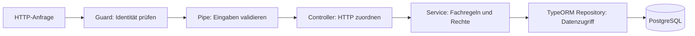

# Architektur und Konventionen

Status: Arbeitsgrundlage für die gemeinsame Umsetzung; noch nicht implementiert.

## Struktur nach Fachbereichen

ClubHub wird ein modularer Monolith. Ein Fachbereich besitzt sein Nest-Modul,
seine Controller, Services, DTOs und Entities. Wir starten mit wenigen Dateien
und ergänzen weitere Module, sobald wir ihre Funktionen gemeinsam portieren.

Beispiel für die spätere Struktur:

```text
src/
  main.ts
  app.module.ts
  config/
  database/
    data-source.ts
    migrations/
  common/
    filters/
  modules/
    users/
      users.module.ts
      users.controller.ts
      users.service.ts
      users.service.spec.ts
      dto/
        create-user.dto.ts
        update-user.dto.ts
        user-response.dto.ts
      entities/
        user.entity.ts
    clubs/
    auth/
test/
  integration/
  e2e/
docs/
  decisions/
```

## Ablauf einer Anfrage



- **Controller:** Route, Parameter, DTO und HTTP-Status. Delegiert an einen Service.
- **Service:** führt einen Anwendungsfall aus und prüft beispielsweise
  Club-Mitgliedschaft oder Adminrechte. Legt Transaktionsgrenzen fest.
- **Repository:** liest und schreibt Entities. Für einfache Zugriffe verwenden
  wir direkt das injizierte `Repository<Entity>` von TypeORM. Wiederkehrende,
  komplexe Abfragen können später eine eigene fachliche Repository-Klasse erhalten.
- **Entity:** beschreibt die Datenbankabbildung einschließlich Constraints und
  Relationen. Wird nicht direkt als öffentliche HTTP-Antwort verwendet.
- **Request-DTO:** beschreibt erlaubte Eingabefelder und Laufzeitvalidierung.
- **Response-DTO:** beschreibt die bewusst freigegebenen Antwortfelder.
  Passwort-Hashes gehören niemals hinein.

Das Repository-Pattern liefert TypeORM bereits. Eine zusätzliche allgemeine
`BaseRepository`- oder `BaseService`-Hierarchie ist für die ersten Anwendungsfälle
nicht erforderlich. Abstraktionen entstehen aus konkreter Wiederholung.

## Verbindliche Arbeitskonventionen

1. Englische Code-Bezeichner, deutsche Lern- und Architekturdokumentation.
2. Dateinamen in `kebab-case`, Klassen in `PascalCase`, Methoden in `camelCase`.
3. TypeScript mit `strict`; `any` nur mit einer konkret dokumentierten Begründung.
4. Constructor Injection; Module exportieren nur benötigte Provider.
5. HTTP-Eingaben über DTO-Klassen und eine globale ValidationPipe prüfen.
   Datenbank-Constraints sichern Regeln zusätzlich gegen parallele Requests ab.
6. Öffentliche Antworten explizit abbilden. Eingabe-, Datenbank- und Antwortmodell
   dürfen unterschiedliche Felder besitzen.
7. Datenbankänderungen über versionierte Migrationen; `synchronize: false`.
8. Innerhalb einer Transaktion ausschließlich deren EntityManager bzw. dessen
   Repositories benutzen. Keine unabsichtlich unabhängigen Schreibzugriffe.
9. Authentifizierung im Guard; objektbezogene Rechte im fachlichen Anwendungsfall.
10. Erwartete Fehler bewusst in HTTP-Status und das ClubHub-Fehlerformat übersetzen.
    Interne Fehlermeldungen und Zugangsdaten nicht an Clients weitergeben.
11. Konfiguration über validierte Umgebungsvariablen; Beispiele ohne echte Secrets.
12. Pro Anwendungsfall passende Tests: Fachregeln als Unit-Tests, Datenbankregeln
    mit PostgreSQL, vollständige HTTP-Abläufe als E2E-Tests.

## Dokumentation pro Änderung

- README: tatsächlich verfügbare Start- und Testbefehle.
- OpenAPI/Swagger: während der Implementierung Request-/Response-Schemas,
  Authentifizierung und Fehlerfälle erfassen.
- Migrationsinventar: Route erst nach Umsetzung und Prüfung als abgeschlossen markieren.
- ADR unter `docs/decisions/`: wesentliche Entscheidung, Begründung und Nachteile.
- Lernjournal: eigenerklärte Konzepte, ausgeführte Checks und offene Fragen.
- Code-Kommentare: Gründe und fachliche Besonderheiten erklären; offensichtlichen
  Code nicht Satz für Satz wiederholen.

Ein Schritt gilt erst als abgeschlossen, wenn er funktioniert, angemessen geprüft
ist, dokumentiert wurde und du seinen Ablauf am Code nachvollziehen kannst.

## Referenzen

- [NestJS TypeORM-Integration](https://docs.nestjs.com/data/typeorm)
- [TypeORM Migrationen](https://typeorm.io/docs/migrations/setup/)
